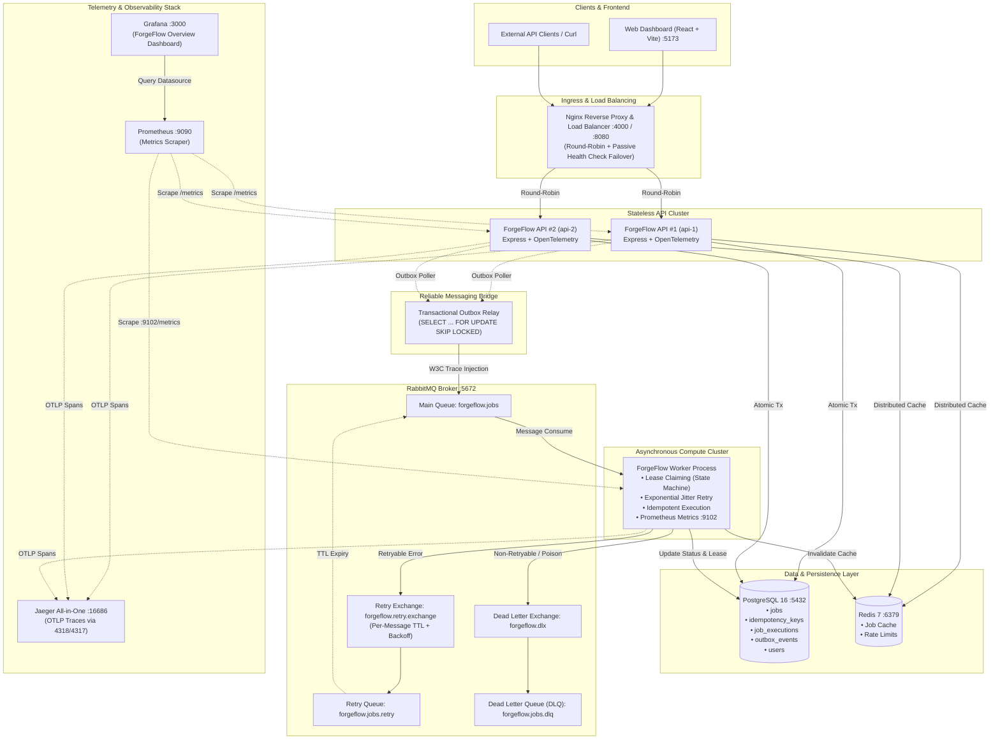

# ForgeFlow

> **Enterprise-Grade Distributed Job Processing & Asynchronous Orchestration Platform**

ForgeFlow is a resilient, horizontally scalable, and fully observable distributed job-processing platform designed for mission-critical cloud environments. It guarantees **at-least-once message delivery**, **exact-once execution semantics (dual-layer idempotency)**, **zero dual-write data loss**, **automated exponential retry/DLQ topologies**, and **end-to-end W3C distributed tracing**.

---

## Table of Contents

- [1. System Architecture Overview](#1-system-architecture-overview)
- [2. End-to-End Request & Job Lifecycle](#2-end-to-end-request--job-lifecycle)
- [3. Core Engineering Pillars](#3-core-engineering-pillars)
  - [3.1 Dual-Layer Defense-in-Depth Idempotency](#31-dual-layer-defense-in-depth-idempotency)
  - [3.2 Transactional Outbox Pattern](#32-transactional-outbox-pattern)
  - [3.3 RabbitMQ Retry & Dead Letter Queue (DLQ) Architecture](#33-rabbitmq-retry--dead-letter-queue-dlq-architecture)
  - [3.4 Stateless API Clustering & Load Balancing](#34-stateless-api-clustering--load-balancing)
  - [3.5 Full-Stack Observability & Telemetry](#35-full-stack-observability--telemetry)
- [4. Repository Monorepo Structure](#4-repository-monorepo-structure)
- [5. Port & Service Topology](#5-port--service-topology)
- [6. Quick Start with Docker Compose](#6-quick-start-with-docker-compose)
- [7. Local Native Development](#7-local-native-development)
- [8. API Reference](#8-api-reference)
- [9. Automated Verification & Test Suites](#9-automated-verification--test-suites)
- [10. Technical Documentation Index](#10-technical-documentation-index)

---

## 1. System Architecture Overview

ForgeFlow is organized as an enterprise TypeScript monorepo with decoupled services communicating over HTTP, AMQP, and PostgreSQL wire protocols:



---

## 2. End-to-End Request & Job Lifecycle

1. **Client Ingress & Correlation**:
   The client issues `POST /jobs` through Nginx with an `Authorization: Bearer <JWT>`, an `Idempotency-Key: <UUID>`, and an optional `X-Request-ID`. Nginx proxies the request to an API node (`api-1` or `api-2`).
2. **Correlation & Distributed Tracing**:
   The API's correlation middleware extracts or generates a standard UUID v4 `requestId`, while OpenTelemetry initiates the root HTTP server span (`POST /jobs`).
3. **Layer 1 Idempotency Check**:
   The API queries `idempotency_keys` in PostgreSQL. If the key exists for this user, the stored job is returned immediately with HTTP `200 OK` and `Idempotent-Replayed: true`. No duplicate record or broker event is created.
4. **Atomic Transactional Outbox Write**:
   If the key is new, a single atomic PostgreSQL transaction writes:
   - The job entity into `jobs` (status `PENDING`).
   - The idempotency mapping into `idempotency_keys`.
   - The outbox message into `outbox_events` (carrying domain payload, `requestId`, and current W3C `traceparent`).
5. **Asynchronous Outbox Dispatch**:
   The Outbox Publisher uses `SELECT ... FOR UPDATE SKIP LOCKED` to safely claim pending events across multiple API nodes without lock contention. It publishes the event to RabbitMQ's `forgeflow.jobs` queue with W3C trace headers and marks the outbox event `PUBLISHED`.
6. **Worker Lease Claiming (Layer 2 Idempotency)**:
   The Worker consumes the message from RabbitMQ. It extracts the W3C traceparent to continue the distributed trace. It checks `job_executions`:
   - If already `COMPLETED`, the message is acknowledged and skipped immediately (preventing duplicate execution).
   - If not executed, it claims an execution lease (`status = 'RUNNING'`) inside a database transaction.
7. **Job Execution & State Machine Transition**:
   The worker executes the job processor (PDF generation, data processing, AI summary, or email).
   - **On Success**: The job is marked `COMPLETED`, execution duration is logged, Redis cache is invalidated, and RabbitMQ `basicAck` is invoked.
   - **On Retryable Failure** (e.g. network timeout, 503): Routed to `forgeflow.retry.exchange` with exponential backoff and jitter via per-message TTL.
   - **On Non-Retryable Failure / Poison Pill**: Routed directly to the Dead Letter Queue (`forgeflow.dlq`) with full diagnostic headers.

---

## 3. Core Engineering Pillars

### 3.1 Dual-Layer Defense-in-Depth Idempotency

ForgeFlow protects both the ingest boundary and the asynchronous compute boundary:

| Feature | Layer 1: API Idempotency | Layer 2: Worker-Side Idempotency |
| :--- | :--- | :--- |
| **Failure Mode** | Client double-click, browser timeout retries on `POST /jobs` | RabbitMQ message redelivery, network blip before ACK |
| **Identity Token** | Client-supplied `Idempotency-Key` header | System-generated `job_id` (UUID) |
| **Backing Store** | `idempotency_keys (user_id, key)` | `job_executions (job_id)` |
| **Constraint** | `UNIQUE (user_id, key)` | `UNIQUE (job_id)` |
| **Action** | Skips database insert & outbox event; returns cached job | Skips long-running task; acknowledges message |
| **Stale Recovery** | Handled at request time | Recovers orphaned leases if worker crashed > 5 minutes ago |

### 3.2 Transactional Outbox Pattern

The classic **dual-write problem** occurs when a service writes to a database and then publishes to a message broker. If the process crashes or network fails between the two steps, database state is saved but the message is lost forever.

```
❌ NAIVE FLOW:
BEGIN Tx -> INSERT jobs -> COMMIT Tx -> [CRASH!] -> publishToRabbitMQ() (NEVER RUNS!)

✅ FORGEFLOW TRANSACTIONAL OUTBOX:
BEGIN Tx -> INSERT jobs -> INSERT outbox_events -> COMMIT Tx
                │
                ▼ (Guaranteed Atomicity)
   [Background Relay: SELECT ... FOR UPDATE SKIP LOCKED]
                │
                ▼
      publishToRabbitMQ() -> UPDATE outbox_events SET status = 'PUBLISHED'
```

- **Guarantees**: At-least-once delivery, zero orphaned jobs, decoupled broker latency.
- **Concurrency**: `SKIP LOCKED` ensures multiple API nodes can poll and publish outbox batches concurrently without lock collisions or duplicate messages.

### 3.3 RabbitMQ Retry & Dead Letter Queue (DLQ) Architecture

Instead of dangerous naive `nack(requeue=true)` loops (which cause 100% CPU spikes, head-of-line blocking, and thundering herds), ForgeFlow uses standard RabbitMQ **Dead Letter Exchanges (DLX)** combined with **Per-Message TTL**:

```
[Main Queue: forgeflow.jobs]
         │ (consume)
         ▼
[Worker Processor]
   ├─► Success: manual ACK
   ├─► Retryable Failure (attempts < 3):
   │        │
   │        ▼
   │   [Retry Exchange: forgeflow.retry.exchange]
   │        │
   │        ▼
   │   [Retry Queue: forgeflow.jobs.retry (x-message-ttl: backoff)]
   │        │ (TTL expires)
   │        ▼
   │   (Dead-lettered back to Main Queue: forgeflow.jobs)
   │
   └─► Max Retries Exhausted OR Non-Retryable Error (Validation, Poison message):
            │
            ▼
       [Dead Letter Exchange: forgeflow.dlx]
            │
            ▼
       [Dead Letter Queue: forgeflow.jobs.dlq] (Preserved with diagnostic x-headers)
```

- **Exponential Backoff with Full Jitter Formula**:
  $$\text{Delay} = \text{random}(0, \, \min(\text{maxDelay}, \, \text{baseDelay} \times 2^{\text{attempt}}))$$
- **Error Classification**:
  - `RetryableError`: Socket timeout, network reset, HTTP 503/504, DB deadlocks.
  - `NonRetryableError`: Malformed payloads, missing fields, schema violations, invalid templates.

### 3.4 Stateless API Clustering & Load Balancing

- **Nginx Ingress**: Acts as reverse proxy on ports `4000` (API) and `8080`, performing round-robin load balancing across `api-1` and `api-2`.
- **Passive Health Checking**: Automatically removes failing API instances (`max_fails=3 fail_timeout=10s`) with zero downtime.
- **100% Stateless API**:
  - Stateless JWT authentication signed by a shared secret (`JWT_SECRET`).
  - Shared distributed cache via Redis.
  - Shared PostgreSQL persistence.
  - No in-memory state or sticky sessions required.

### 3.5 Full-Stack Observability & Telemetry

ForgeFlow implements all **Three Pillars of Observability**:

1. **Structured JSON Logging**:
   - Machine-parseable single-line JSON format.
   - Standard schema: `timestamp`, `level`, `service`, `event`, `requestId`, `jobId`, `instanceId`, `workerId`, `durationMs`.
   - Automatic redaction of passwords, tokens, API keys, and sensitive headers.
2. **Prometheus Metrics**:
   - Standard **RED Method** (Rate, Errors, Duration) metrics.
   - HTTP server latency histograms (`forgeflow_http_request_duration_seconds`).
   - Worker processing counters & gauges (`forgeflow_jobs_processed_total`, `forgeflow_job_execution_duration_seconds`, `forgeflow_worker_queue_depth`).
   - DLQ message counter (`forgeflow_worker_dlq_messages_total`).
   - Strict low-cardinality label enforcement.
3. **OpenTelemetry & Jaeger Distributed Tracing**:
   - OpenTelemetry SDK initializes before any instrumented modules (`http`, `express`, `pg`) load.
   - W3C Trace Context propagation across process boundaries:
     $$\text{HTTP Request} \longrightarrow \text{PostgreSQL Outbox} \longrightarrow \text{RabbitMQ Header} \longrightarrow \text{Worker Execution}$$
   - Zero fragmented traces: all database queries, middleware, outbox events, and worker operations belong to a single unified distributed trace tree in Jaeger.
4. **Pre-Provisioned Grafana Dashboard**:
   - Auto-provisioned datasource pointing to Prometheus.
   - 21 pre-configured panels visualizing system health, throughput, latency percentiles (p50, p95, p99), queue saturation, error rates, and worker performance.

---

## 4. Repository Monorepo Structure

```
forgeflow/
├── apps/
│   ├── api/                     # Express REST API (Cluster nodes api-1, api-2)
│   │   ├── src/
│   │   │   ├── tracing.ts       # OpenTelemetry bootstrap module (loads 1st)
│   │   │   ├── controllers/     # Request handlers (auth, jobs)
│   │   │   ├── services/        # Business logic & transaction orchestration
│   │   │   ├── repositories/    # Database queries (jobs, idempotency, outbox)
│   │   │   ├── middlewares/     # Correlation, JWT auth, validation, metrics
│   │   │   ├── outbox/          # Transactional Outbox relay poller
│   │   │   └── queue/           # RabbitMQ connection & publisher
│   │   ├── test/                # Comprehensive test suites (LB, outbox, tracing, metrics)
│   │   └── Dockerfile           # Multi-stage production container
│   │
│   ├── worker/                  # Background Worker service
│   │   ├── src/
│   │   │   ├── tracing.ts       # Worker OpenTelemetry bootstrap module
│   │   │   ├── queue/           # Consumer, retry/DLQ routing, topology assertion
│   │   │   ├── processors/      # Workload executors (PDF, AI, email, data)
│   │   │   ├── metrics/         # Prometheus worker metrics exporter (:9102)
│   │   │   └── db/              # Lease management & execution repository
│   │   ├── test/                # Worker idempotency & RabbitMQ retry/DLQ tests
│   │   └── Dockerfile
│   │
│   └── web/                     # React + Vite + TypeScript Frontend Dashboard
│       ├── src/
│       │   ├── components/      # UI components (JobTable, Stats, Modals)
│       │   ├── context/         # Auth & Session state
│       │   └── services/        # HTTP API client
│       └── Dockerfile
│
├── packages/
│   └── shared/                  # Common library shared across apps
│       ├── src/
│       │   ├── logger.ts        # Structured JSON logger & redactor
│       │   ├── metrics.ts       # Prometheus metric definitions & registry
│       │   ├── tracing.ts       # OpenTelemetry SDK configuration & W3C helpers
│       │   └── retry.ts         # Exponential backoff & jitter calculations
│       └── test/                # Shared package unit tests
│
├── docs/                        # Deep-dive educational architecture documentation
│   ├── architecture-v1.md       # Foundation architecture
│   ├── idempotency.md           # Dual-layer idempotency specification
│   ├── load-balancing.md        # Nginx load balancing & statelessness
│   ├── observability.md         # Logging, metrics, tracing, and Grafana
│   ├── outbox.md                # Transactional outbox pattern specification
│   └── retries.md               # RabbitMQ retry & DLQ topology specification
│
├── grafana/                     # Grafana provisioning configurations
│   ├── dashboards/              # Pre-provisioned "ForgeFlow Overview" dashboard
│   └── provisioning/            # Datasource auto-provisioning
├── nginx/                       # Nginx reverse proxy configuration
│   └── nginx.conf
├── prometheus/                  # Prometheus scraping configuration
│   └── prometheus.yml
├── docker-compose.yml           # Complete local multi-container stack
├── package.json                 # Monorepo root workspaces config
└── tsconfig.json
```

---

## 5. Port & Service Topology

| Service | Container Name | Internal Port | Host Port | Description |
| :--- | :--- | :--- | :--- | :--- |
| **Web Dashboard** | `forgeflow-web` | 5173 | `5173` | React frontend application |
| **Load Balancer** | `forgeflow-nginx` | 80 | `4000`, `8080` | Public API gateway entrypoint |
| **API Instance 1**| `forgeflow-api1` | 4000 | — | Express API Node 1 (internal) |
| **API Instance 2**| `forgeflow-api2` | 4000 | — | Express API Node 2 (internal) |
| **Worker Node** | `forgeflow-worker` | 9102 | `9102` | Background worker metrics |
| **PostgreSQL** | `forgeflow-postgres`| 5432 | `5432` | Relational source of truth |
| **Redis** | `forgeflow-redis` | 6379 | `6379` | Distributed cache |
| **RabbitMQ** | `forgeflow-rabbitmq`| 5672, 15672 | `5672`, `15672`| AMQP Broker & Management UI |
| **Prometheus** | `forgeflow-prometheus`| 9090 | `9090` | Time-series metrics engine |
| **Grafana** | `forgeflow-grafana` | 3000 | `3000` | Telemetry dashboards (`admin`/`admin`) |
| **Jaeger** | `forgeflow-jaeger` | 16686, 4318 | `16686`, `4318`| Distributed trace visualizer |

---

## 6. Quick Start with Docker Compose

Running the entire distributed system locally requires only Docker and Docker Compose.

### 1. Start the Complete Stack

```bash
# Clone the repository
git clone https://github.com/Ragu3175/Forgeflow.git
cd Forgeflow

# Build and start all 11 services in background
docker compose up -d --build
```

### 2. Verify Container Health

```bash
docker compose ps
```

All services will show `Up` and `(healthy)`.

### 3. Access UIs

- **Web Dashboard**: [http://localhost:5173](http://localhost:5173)
- **API Gateway Health**: [http://localhost:4000/health](http://localhost:4000/health)
- **API Gateway Readiness**: [http://localhost:4000/ready](http://localhost:4000/ready)
- **RabbitMQ Management**: [http://localhost:15672](http://localhost:15672) (guest / guest)
- **Prometheus UI**: [http://localhost:9090](http://localhost:9090)
- **Grafana Dashboard**: [http://localhost:3000](http://localhost:3000) (admin / admin)
- **Jaeger Tracing UI**: [http://localhost:16686](http://localhost:16686)

### 4. Stop Stack

```bash
docker compose down
```

---

## 7. Local Native Development

If running natively on the host machine without full containerization:

### Prerequisites

- **Node.js**: v20.0.0 or higher
- **npm**: v10.0.0 or higher
- **PostgreSQL 16**, **Redis 7**, **RabbitMQ 3** running locally.

### Installation

```bash
npm install
```

### Environment Setup

Create `.env` files in `apps/api/.env` and `apps/worker/.env` (referencing `.env.example`).

### Run Database Migrations

```bash
npm run migrate
```

### Start Services

```bash
# Start API in development mode
npm run dev:api

# Start Worker in development mode
npm run dev:worker

# Start Frontend web dashboard
npm run dev:web
```

---

## 8. API Reference

All requests pass through the Nginx gateway at `http://localhost:4000`.

### Authentication

#### Register
```http
POST /auth/register
Content-Type: application/json

{
  "name": "Jane Doe",
  "email": "jane@example.com",
  "password": "SecurePassword123!"
}
```

#### Login
```http
POST /auth/login
Content-Type: application/json

{
  "email": "jane@example.com",
  "password": "SecurePassword123!"
}
```

#### Get Current Profile
```http
GET /auth/me
Authorization: Bearer <TOKEN>
```

---

### Jobs

#### Create Job (with Idempotency Key)
```http
POST /jobs
Authorization: Bearer <TOKEN>
Idempotency-Key: e2d97ab8-4275-4f8f-81a7-c7d477df5989
X-Request-ID: req-client-001
Content-Type: application/json

{
  "type": "PDF_GENERATION",
  "payload": {
    "templateId": "invoice-v2",
    "documentId": "INV-2026-99"
  }
}
```

*Supported Job Types:* `PDF_GENERATION`, `DATA_PROCESSING`, `AI_SUMMARY`, `EMAIL`, `CUSTOM`.

**Response (201 Created):**
```json
{
  "id": "e2d97ab8-4275-4f8f-81a7-c7d477df5989",
  "userId": "9a12c4fe-...",
  "type": "PDF_GENERATION",
  "payload": { "templateId": "invoice-v2", "documentId": "INV-2026-99" },
  "status": "PENDING",
  "createdAt": "2026-10-09T12:00:00.000Z",
  "updatedAt": "2026-10-09T12:00:00.000Z",
  "startedAt": null,
  "completedAt": null,
  "error": null
}
```

*Note:* Re-sending the identical request with the same `Idempotency-Key` returns HTTP `200 OK` with header `Idempotent-Replayed: true` and the exact same job ID, with no duplicate executions.

#### List Jobs
```http
GET /jobs?status=COMPLETED&type=PDF_GENERATION&limit=20&offset=0
Authorization: Bearer <TOKEN>
```

#### Get Job Details
```http
GET /jobs/:id
Authorization: Bearer <TOKEN>
```

#### Cancel Job
```http
POST /jobs/:id/cancel
Authorization: Bearer <TOKEN>
```

---

### Observability Endpoints

- **Health Check**: `GET /health` (Returns instance identifier and status)
- **Readiness Check**: `GET /ready` (Verifies DB, Redis, and RabbitMQ connectivity)
- **Prometheus Metrics (API)**: `GET /metrics`
- **Prometheus Metrics (Worker)**: `GET http://localhost:9102/metrics`

---

## 9. Automated Verification & Test Suites

ForgeFlow includes comprehensive test suites covering all distributed systems capabilities:

```bash
# 1. Typecheck & Build all workspaces
npm run typecheck
npm run build

# 2. Shared Library Unit Tests (Retry, Logger, Metrics, Tracing)
npm run test --workspace=@forgeflow/shared

# 3. Worker Tests (Idempotency scenarios A-E, RabbitMQ Retry/DLQ tests 1-5)
npm run test --workspace=@forgeflow/worker

# 4. API & Integration Test Suites
npm run test:lb --workspace=@forgeflow/api       # Load balancing & failover tests
npm run test:outbox --workspace=@forgeflow/api   # Transactional outbox atomicity tests
npm run test:obs --workspace=@forgeflow/api      # Structured logging & correlation tests
npm run test:metrics --workspace=@forgeflow/api  # Prometheus RED metrics verification
npm run test:grafana --workspace=@forgeflow/api  # Grafana dashboard & datasource tests
npm run test:tracing --workspace=@forgeflow/api  # End-to-end distributed tracing tests

# 5. Run Entire Monorepo Test Suite
npm run test
```

---

## 10. Technical Documentation Index

For in-depth architectural analyses and implementation notes, consult the `docs/` directory:

- [Foundation Architecture (V1)](docs/architecture-v1.md)
- [Dual-Layer Idempotency Specification](docs/idempotency.md)
- [Transactional Outbox Pattern Specification](docs/outbox.md)
- [RabbitMQ Retry & Dead Letter Queue (DLQ) Topology](docs/retries.md)
- [Nginx Load Balancing & Stateless API Architecture](docs/load-balancing.md)
- [Observability: Structured Logging, Metrics, Tracing & Grafana](docs/observability.md)

---

## License

This project is licensed under the ISC License.
