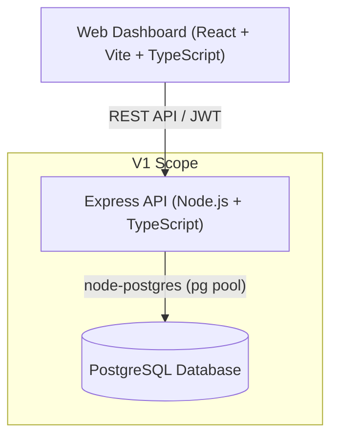
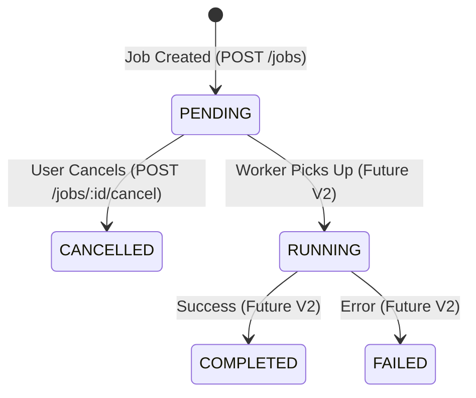

# ForgeFlow V1 Architecture & Engineering Design

ForgeFlow is designed as a distributed job-processing platform built incrementally. To understand distributed systems deeply, we start with a clean, unbloated foundation (V1) before introducing queues, worker pools, brokers, and cloud infrastructure in subsequent phases.

---

## Architecture Overview (V1)

In V1, ForgeFlow follows a classic, clean three-tier architecture:

### Key Principles

1. **No Premature Complexity**: No Redis, RabbitMQ, Kafka, Docker, Kubernetes, AWS, or background workers exist in V1.
2. **Database as Single Source of Truth**: Job records are created directly with status `PENDING`.
3. **Inspectable & Transparent**: Database migrations, tables, and relationships are written in pure SQL without heavy ORM abstractions.
4. **Strict Type Safety**: Monorepo shared package `@forgeflow/shared` provides consistent types and contracts between Frontend and Backend.

---

## Data Model

### `users` Table
Stores registered accounts with salted `bcrypt` password hashes.

| Column | Type | Constraints | Description |
|---|---|---|---|
| `id` | UUID | PRIMARY KEY, DEFAULT `gen_random_uuid()` | Unique user identifier |
| `email` | VARCHAR(255) | UNIQUE, NOT NULL | User login email (case-insensitive) |
| `password_hash` | VARCHAR(255) | NOT NULL | Bcrypt hashed password |
| `name` | VARCHAR(255) | NOT NULL | Display name |
| `created_at` | TIMESTAMPTZ | DEFAULT `NOW()` | Registration timestamp |
| `updated_at` | TIMESTAMPTZ | DEFAULT `NOW()` | Profile update timestamp |

### `jobs` Table
Stores job records and execution metadata.

| Column | Type | Constraints | Description |
|---|---|---|---|
| `id` | UUID | PRIMARY KEY, DEFAULT `gen_random_uuid()` | Unique job identifier |
| `user_id` | UUID | FOREIGN KEY `users(id)` ON DELETE CASCADE | Owning user ID |
| `type` | VARCHAR(50) | NOT NULL | Job type (`PDF_GENERATION`, `DATA_PROCESSING`, etc.) |
| `payload` | JSONB | NOT NULL DEFAULT `'{}'` | Task parameters and input data |
| `status` | VARCHAR(50) | NOT NULL DEFAULT `'PENDING'` | Current status |
| `created_at` | TIMESTAMPTZ | DEFAULT `NOW()` | Submission timestamp |
| `updated_at` | TIMESTAMPTZ | DEFAULT `NOW()` | State change timestamp |
| `started_at` | TIMESTAMPTZ | NULL | Timestamp when worker picked job up (future) |
| `completed_at` | TIMESTAMPTZ | NULL | Timestamp when job finished (future) |
| `error` | TEXT | NULL | Error diagnostics if failed |

---

## Job Lifecycle (V1 State Machine)

In V1:
- A user creates a job -> Status is `PENDING`.
- A user can cancel any `PENDING` job -> Status transitions to `CANCELLED`.
- `RUNNING`, `COMPLETED`, and `FAILED` states exist in the schema and types in anticipation of worker execution engines in V2.

---

## API Layer Design

- **Routes (`src/routes/`)**: Pure route declarations with URL mappings and middleware attachments.
- **Middlewares (`src/middlewares/`)**: JWT verification, request body & query validation using Zod, and global error handling.
- **Controllers (`src/controllers/`)**: HTTP request parsing, status code handling, and response serialization.
- **Services (`src/services/`)**: Business logic (password hashing, state validation, authorization rules).
- **Repositories (`src/repositories/`)**: Direct SQL queries parameterized to protect against SQL injection.

---

## Roadmap to Future Versions

- **V2 (Asynchronous Worker Pools)**: Worker processes polling PostgreSQL using `SELECT ... FOR UPDATE SKIP LOCKED` or listen/notify.
- **V3 (Distributed Message Broker)**: Introduction of Redis / RabbitMQ / Kafka for decoupled job dispatching.
- **V4 (Containerization & Orchestration)**: Dockerizing services, Kubernetes deployments, and autoscaling workers.
- **V5 (Cloud Architecture & Observability)**: Terraform provisioning on AWS/GCP, distributed tracing, OpenTelemetry, metrics, and structured log streaming.
